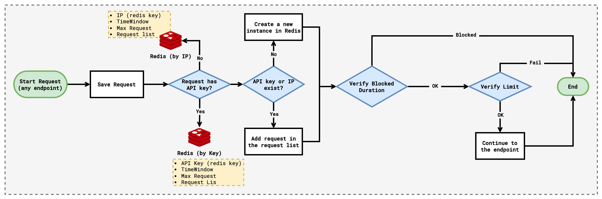

# 🚧 FullCycle rate limiter

Rate Limiter challenge: Basic implementation of rate limiter middleware and tested
using [🔗 golang chi](https://github.com/go-chi/chi).

# 🏭 How it works?

- At the moment of the first request, we store this by IP or by API key.
- We have this structure to handle the requests:
  ```go
  // RateLimiter is a struct that implements rate limiting logic.
  // It's designed to limit the number of Requests allowed within a specified time window.
  type RateLimiter struct {
      // Requests is a slice of time.Time that holds the timestamps of the incoming Requests.
      // It is used to keep track of the Requests that have been made and whether a new request
      // should be allowed or not based on the timing of previous Requests.
      Requests []time.Time
  
      // TimeWindowSec specifies the duration in SECONDS of the time window for which the Requests are counted.
      // For instance, if TimeWindow is set to 60, the RateLimiter will only consider
      // the number of Requests in the last minute.
      TimeWindowSec int64
  
      // MaxRequests defines the maximum number of Requests that are allowed within the TimeWindow.
      // For example, if we have TimeWindowSec = 1 and MaxRequests = 100, we obtain the max request limit 100 req/s
      // Other example, if we have TimeWindowSec = 60 and MaxRequests = 100, we obtain the max request limit 100 req/min
      MaxRequests int
  
      // lock is a mutex that ensures that access to the Requests slice is synchronized across multiple goroutines.
      lock sync.Mutex
  }
  ```
- If we have IP, we store the IP as key and this struct as a value:
```json
  {
    "max_requests": 10,
    "time_window_sec": 1,
    "requests": [
      1704787618,
      1704787619,
      1704787620,
      1704787621
    ]
  }
```
- If we have API key, we store API key as a key and the same struct as a value.
- Then, we verify if the given IP or API key are blocked. We stored a blocked key in the RedisDB by 
  setting an EXPIRE time.
- 




- We have two endpoints to test.

# 🏔️ Env Variables

## IP configuration

- We have this env file called `./env.json.example`:

```json
{
  "app": {
    "port": "8080"
  },
  "redis": {
    "db": 0,
    "host": "redis",
    "port": "6379"
  },
  "rate_limiter": {
    "by_ip": {
      "time_window": 1,
      "max_requests": 10,
      "blocked_duration": 60
    }
  }
}
```

where:

- `time_window`: is the value of **SECONDS** that we can allow the maximum amount of request.
- `max_requests`: is the maximum amount of request that we can allow each `time_window` seconds.
- `blocked_duration`: is the number of **SECONDS** that the IP is blocked, so we do not allow requests from this IP.

## API Token configuration

In the case of API token, we can create a new token by using this http request:

```http request
POST http://127.0.0.1:8080/api-key
Content-Type: application/json

{
  "time_window": 1,
  "max_requests": 100,
  "blocked_duration": 600
}
```

Each token has different configuration.

# 🚀 Starting the application!

- Execute the command `make prepare`, this will copy the default configuration.
- Before you execute the docker compose command, you can edit the `env.json` configuration file with your onw values.
- Finally, you can execute using the command `make run`

# 🧪 How can I test?

To learn more about the CLI using for test, you can run this:

```shell
docker compose run --rm go-cli-test -h
```

## Testing with IP only

Using docker you can run this command:

```shell
docker compose run --rm go-cli-test -url http://go-app:8080/hello-world -m GET -t 1 -r 10
```

## Testing with API key

- First, you need to execute this http request:
   ```http request
    POST http://127.0.0.1:8080/api-key
    Content-Type: application/json
    
    {
      "time_window": 1,
      "max_requests": 10,
      "blocked_duration": 60
    }
   ```
- You will receive the response something like this (the api-key will be different)
   ```json
    {
      "api-key": "c6f7363326f62f2483756447a963f2369a0dd5e90b7e8a36c32bc1a62ed38f51"
    }
   ```
- Copy the value of `api-key` and execute the following command, you should put your own token in the `-k` flag.
   ```shell
   docker compose run --rm go-cli-test -url http://go-app:8080/hello-world-key -m GET -t 1 -r 10 -k c6f7363326f62f2483756447a963f2369a0dd5e90b7e8a36c32bc1a62ed38f51
   ```

- If you need to execute at the same time, please execute this shell script file: `./run.sh`, you need to install `jq`. 

# 💿 Redis DB

Here, we'll explain about the keys stored in redisDB. We are
using [🔗 this redis UI](https://redis.com/redis-enterprise/redis-insight/) to see the data. We have these keys:

## API Key keys

- `<apikey>`: we have this to store the configuration data of each API Key, we have this value as example:
  key: `880d207159a7ac1a5a800eabbb310cf851e3c00cb5a2ff6e1ab9f38ce21bcc99`,
  value:
  ```json
  {
    "max_requests": 10,
    "time_window": 1,
    "blocked_duration": 60
  }
  ```
- `rate:api-key_<apikey>`: We have this to store the rates for the given `<apikey>`, we have this value as example:
  key: `rate:api-key_880d207159a7ac1a5a800eabbb310cf851e3c00cb5a2ff6e1ab9f38ce21bcc99`,
  value:
  ```json
  {
    "max_requests": 10,
    "time_window_sec": 1,
    "requests": [
      1704787618,
      1704787619,
      1704787620,
      1704787621
    ]
  }
  ```
- `blocked:api-key_<apikey>`: We have this to store the amount of time that the `<apikey>` is blocked and doesn't
  receive more requests, we have this value as example:
    - key: `blocked:api-key_880d207159a7ac1a5a800eabbb310cf851e3c00cb5a2ff6e1ab9f38ce21bcc99`
    - value: `APIKeyBlocked`.
    - This key has a duration in the redis database, this duration is the value of `blocked_duration` saved in the
      API Key configuration data.

## IP keys

- `rate:ip_<ip>`: We have this to store the rates for the given `<ip>`, we have this value as example:
    - key: `rate:ip_127.0.0.1`,
    - value:
      ```json
      {
        "max_requests": 10,
        "time_window_sec": 1,
        "requests": [
          1704787618,
          1704787619,
          1704787620,
          1704787621
        ]
      }
      ```
- `blocked:ip_<ip>`: We have this to store the amount of time that the `<ip>` is blocked and doesn't
  receive more requests, we have this value as example:
    - key: `blocked:ip_127.0.0.1`
    - value: `IPBlocked`
    - This key has a duration in the redis database, this duration is the value of `rate_limiter.by_ip.blocked_duration`
      saved in the `./env.json` configuration data.
